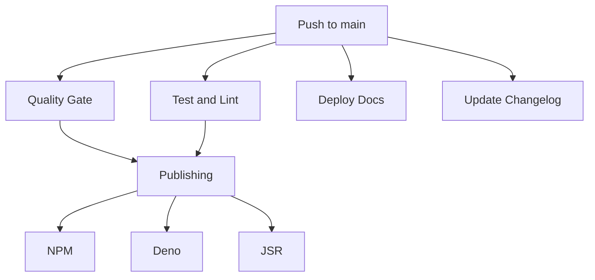

# Drift KV CI/CD Documentation

This document provides a comprehensive overview of all automated workflows in the Drift KV project.

## GitHub Actions Workflows

### Code Quality & Testing

1. **Quality Gate** (`quality-gate.yml`)

   - **Trigger**: Pull requests to `main`
   - **Purpose**: Ensures code quality standards
   - **Steps**:
     - Type checking
     - Test coverage analysis
     - Bundle size analysis

2. **Test and Lint** (`test-and-lint.yml`)

   - **Trigger**: Push to `main`, Pull requests
   - **Purpose**: Code quality assurance
   - **Steps**:
     - Run ESLint
     - Execute test suite

3. **Coverage** (`coverage.yml`)
   - **Trigger**: Push to `main`, Pull requests
   - **Purpose**: Code coverage tracking
   - **Steps**:
     - Run tests with coverage
     - Upload to Codecov
     - Coverage report generation

### Publishing & Deployment

1. **Main Publishing** (`publish.yml`)

   - **Trigger**: Push to `main`
   - **Purpose**: Version management and publishing
   - **Steps**:
     - Version bump
     - NPM publish
     - Deno publish
     - JSR publish

2. **NPM Publishing** (`publish-npm.yml`)

   - **Trigger**: Version tags (v*.*.\*)
   - **Purpose**: NPM package publishing
   - **Steps**:
     - Build package
     - Publish to NPM registry

3. **Deno Publishing** (`publish-deno.yml`)

   - **Trigger**: Version tags (v*.*.\*)
   - **Purpose**: Deno module publishing
   - **Steps**:
     - Publish to Deno registry
     - Publish to JSR

4. **Deployment** (`deploy.yml`)
   - **Trigger**: Push to `main`
   - **Purpose**: Documentation site deployment
   - **Steps**:
     - Build Next.js app
     - Deploy to GitHub Pages

### Security & Maintenance

1. **Security Check** (`security.yml`)

   - **Trigger**: Weekly (Monday at 00:00)
   - **Purpose**: Security vulnerability scanning
   - **Steps**:
     - Run npm audit
     - Security report generation

2. **Dependabot** (`dependabot.yml`, `dependabot_alerts.yml`)
   - **Trigger**: Weekly
   - **Purpose**: Dependency management
   - **Monitors**:
     - NPM dependencies
     - GitHub Actions
   - **Actions**:
     - Create PRs for updates
     - Security vulnerability alerts

### Documentation & Tracking

1. **Changelog Update** (`update-changelog.yml`)

   - **Trigger**: Push to `main`
   - **Purpose**: Automatic changelog maintenance
   - **Steps**:
     - Generate changelog
     - Commit updates

2. **Roadmap Sync** (`sync-roadmap.yml`)
   - **Trigger**: Changes to ROADMAP.md
   - **Purpose**: Project tracking
   - **Steps**:
     - Sync with GitHub Project
     - Update project items

## Issue Templates

1. **Bug Report**

   - Template for reporting bugs
   - Required information:
     - Bug description
     - Steps to reproduce
     - Expected behavior
     - Environment details

2. **Feature Request**

   - Template for new features
   - Required information:
     - Feature description
     - Use case
     - Proposed solution
     - Success criteria

3. **Documentation Update**
   - Template for doc improvements
   - Required information:
     - Section to update
     - Current content
     - Proposed changes

## Required Secrets

```env
GITHUB_TOKEN=            # GitHub access token
NPM_TOKEN=              # NPM publishing token
DENO_DEPLOY_TOKEN=      # Deno deployment token
JSR_TOKEN=              # JSR publishing token
CODECOV_TOKEN=          # Codecov upload token
PROJECT_ID=             # GitHub Project ID
```

## Workflow Dependencies



## Quality Gates

All PRs must pass:

- Type checking
- Linting
- Tests (min 80% coverage)
- Security audit
- Bundle size check
- Code review

## Release Process

1. Code merged to `main`
2. Quality gates checked
3. Version bumped
4. Packages published
5. Documentation deployed
6. Changelog updated

## Monitoring & Alerts

- Dependabot alerts for security issues
- Weekly security scans
- Coverage reports
- Bundle size monitoring

## Best Practices

1. **Commits**

   - Use conventional commits
   - Reference issues
   - Keep changes focused

2. **Pull Requests**

   - Use PR template
   - Wait for CI checks
   - Request reviews

3. **Versioning**
   - Follow SemVer
   - Update changelog
   - Tag releases

## Issue and PR Management

### Stale Management (`stale.yml`)

- **Trigger**: Runs daily at midnight
- **Purpose**: Maintain active issues and PRs
- **Process**:

  1. **Issues**:
     - Marked stale after 30 days of inactivity
     - Closed after 7 additional days without activity
     - Exempt labels: pinned, security, bug, enhancement, documentation, help wanted
  2. **Pull Requests**:
     - Marked stale after 30 days of inactivity
     - Closed after 7 additional days without activity
     - Exempt labels: pinned, security, dependencies
     - Draft PRs are exempt
  3. **Exceptions**:

     - Items with milestones are exempt
     - Items with specific labels are exempt
     - Activity removes stale status

  4. **Notifications**:
     - Stale warning with instructions
     - Closure notice with reopening instructions

## Release Management

### Release Drafter (`release-drafter.yml`)

- **Trigger**:
  - Push to `main`
  - Pull request events (opened, reopened, synchronize)
- **Purpose**: Automate release notes creation
- **Features**:

  1. **Categorization**:

     - 🚀 Features
     - 🐛 Bug Fixes
     - 🧰 Maintenance
     - 📚 Documentation
     - ⬆️ Dependencies

  2. **Version Resolution**:
     - Major: breaking changes
     - Minor: new features
     - Patch: bug fixes, maintenance
  3. **Auto Labeling**:

     - Based on branch names
     - Based on PR titles
     - Based on commit messages

  4. **Release Notes**:

     - Automatically grouped changes
     - Contributor acknowledgment
     - Comparison links
     - Full changelog links

  5. **Labels**:
     - Automatic PR labeling
     - Version impact labels
     - Category labels

### Release Process

1. PRs are merged to main
2. Release drafter updates draft release
3. Changes are categorized automatically
4. Version is determined by labels
5. Release notes are generated
6. Draft can be published manually

## Additional Automations

### Code Analysis

- **CodeQL**: Security vulnerability scanning
- **Size Limit**: Bundle size monitoring
- **PR/Issue Labeler**: Automatic labeling
- **Branch Cleanup**: Auto-delete merged branches
- **Welcome Bot**: First-time contributor greeting

### Label Automation

- PR labels based on changed files
- Issue labels based on content
- Size labels for PRs
- Difficulty labels for issues

### Branch Management

- Auto-delete after merge
- Protected branch rules
- Required reviews
- Status checks

### Community Management

- Welcome messages
- First-time contributor support
- Automated responses
- Issue/PR templates
